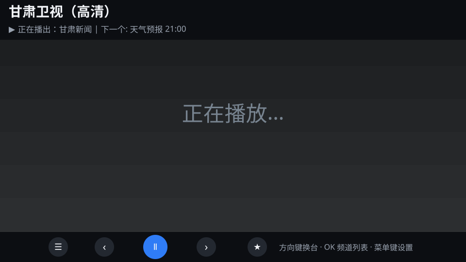
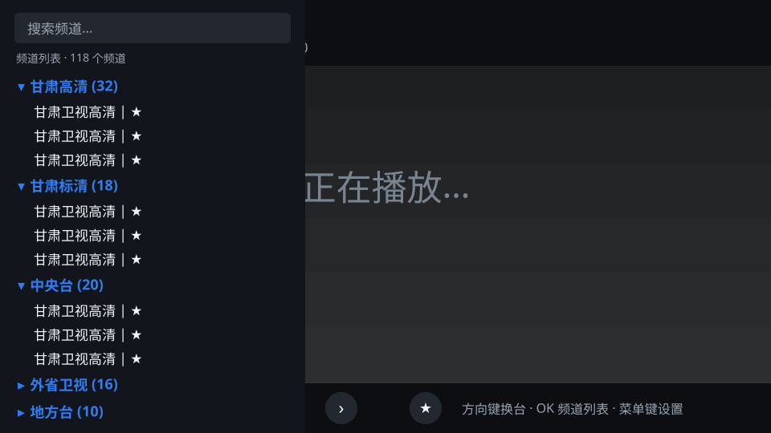
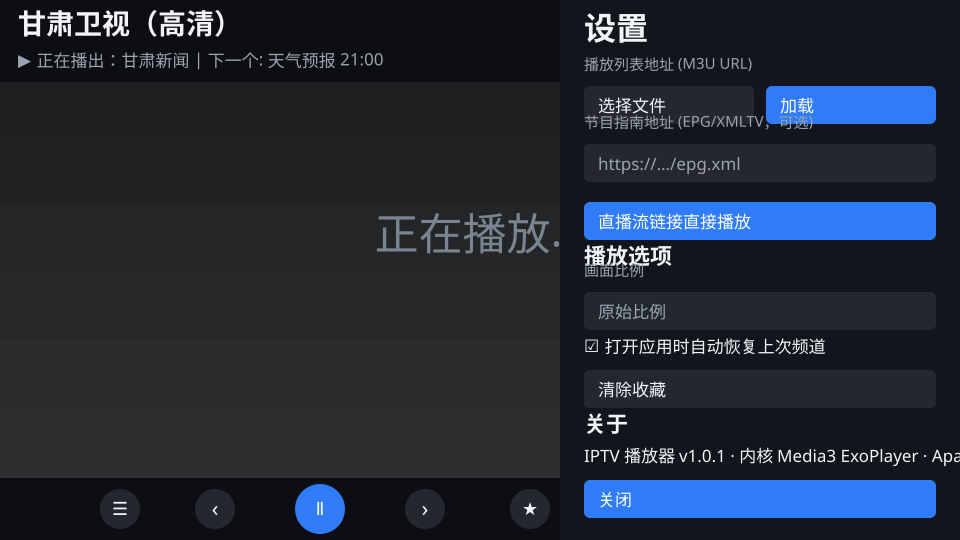

# 揽星 TV（LanXing TV · Android TV IPTV 播放器）

一个类似 TiviMate 的开源 IPTV 播放器，专为 **Android TV / 电视盒子** 设计，支持 **Android 7.0+**。

播放内核使用 **Media3 ExoPlayer**（Google 官方播放器内核），对 HLS 直播流兼容性最好，H.265/HEVC 高清源硬解。

> 以下界面为**示意预览**（非真机截图）。

| 全屏播放 | 频道列表（OK 键唤出） | 设置面板（菜单键唤出） |
| --- | --- | --- |
|  |  |  |

## 功能

- 📺 **M3U / M3U8 / TXT 播放列表**：支持 URL 加载，也支持从本地文件导入
- 📡 **多直播源管理**：可同时配置多个播放列表源，频道列表顶部 **OK 一键切换**；每个源独立缓存，加载失败自动用上次缓存
- 📱 **扫码局域网管理**：机顶盒显示二维码，手机连同一 Wi-Fi 扫码即可在手机上添加/切换直播源、设置节目指南、直接播放
- 📅 **EPG 节目单**（XMLTV）：顶部显示"正在播放/稍后播放"，频道列表中直接显示每个台当前节目
- 🗂️ **二级分组频道列表**：一级为央视/卫视等分组（默认全部收起），展开进入二级频道；支持搜索、收藏，折叠状态自动记忆
- 📶 **自动识别流格式**：HLS (m3u8) / MPEG-TS / MP4 等
- 🖥️ **始终全屏播放**：播放画面不被频道栏遮挡，悬浮层按需唤出
- 🌫️ **信息条自动隐藏**：4 秒无操作自动淡出频道信息和底部控制条，任意按键重新显示
- 🔄 **检查更新自动下载安装**：读取 GitHub 最新 Release，高于当前版本自动下载并拉起系统安装器，配置与收藏保留
- 🛠️ **崩溃日志导出**：真机问题一键导出 txt 发给开发者分析
- 🎨 **画面比例**：原始 / 16:9 / 4:3 / 缩放裁剪 / 拉伸全屏
- 💾 **自动恢复**：打开应用自动续播上次频道
- 📱 **Android 7.0+ 全支持**（minSdk 21），老盒子也能装

## 遥控器操作

| 按键 | 功能 |
| --- | --- |
| 上 / 下 方向键 | 切换上 / 下一个频道（全屏播放态） |
| OK / 确认键 | 唤出 / 收起频道列表（全屏播放态） |
| 菜单键 | 唤出 / 收起右侧设置面板 |
| OK（频道列表顶部直播源条） | 切换直播源 |
| CH+ / CH- | 切换上 / 下一个频道 |
| 播放 / 暂停键 | 播放 / 暂停 |
| 返回键 | 关闭已打开的悬浮面板 |

## 支持的源格式

| 类型 | 说明 |
| --- | --- |
| M3U / M3U8 | 标准播放列表（URL 或本地文件） |
| TXT | 每行 `频道名,流地址`（支持中文逗号、纯地址行） |
| 直播链接 | 单个 http/https 流地址直接播放 |
| EPG | XMLTV 格式节目单（可选） |

## 安装

1. 在 **Releases** 页面下载最新 `iptv-player-vN.apk`（或从 **Actions** 页面最新一次构建下载）
2. 将 APK 复制到电视（U 盘 / Send files to TV / adb install 均可）
3. 电视上开启"允许安装未知来源应用"，安装即可
4. 以后新版本**直接覆盖安装**，播放列表、收藏、配置全部保留

> 打 `tag`（如 `v1.7.0`）时会自动发布 Release 并清理旧版本（Release 列表只保留最近 3 个）。
>
> **签名说明**：构建使用固定 debug 签名（keystore 保存在仓库 `.github/debug-keystore.b64` 与 Actions 缓存）。签名固定后，**所有新版本都可以直接覆盖安装，配置保留**。

## 在 GitHub 上构建

推送到 `main` 分支会自动触发 GitHub Actions 构建 APK（也可以在 Actions 页面手动 Run workflow）。

- 构建产物：`assembleRelease`，用 debug 密钥签名，可直接侧载安装（自用足够）
- 构建成功后自动发布 Release 并只保留最近 3 个版本
- 如需正式发布签名：在 `app/build.gradle.kts` 的 `release` 配置自己的 keystore

## 本地构建（可选）

需要 JDK 17 + Android SDK + Gradle 8.9：

```bash
gradle assembleRelease
# APK 输出: app/build/outputs/apk/release/app-release.apk
```

## 使用

1. 打开应用 → 按遥控器**菜单键**唤出右侧设置面板
2. 在"直播源"页填入播放列表地址（**每行一个**，可配置多个源），或点**选择文件**从本地导入
3. 可选：填入 EPG 节目单地址
4. 返回播放界面，按 **OK 键**唤出频道列表：顶部是直播源切换条（OK 切换），下面是分组列表（默认收起，点分组展开）
5. 也可在设置页点**扫码管理**，用手机扫码在浏览器里管理直播源与节目指南
6. 频道列表内按 **菜单键** 或面板内按钮进入设置

## 技术栈

- Kotlin + AndroidX (AppCompat / RecyclerView / ViewBinding)
- **Media3 ExoPlayer**（HLS 专业支持，H.265/HEVC 硬解）
- **NanoHTTPD**（局域网管理服务）+ **ZXing**（二维码）
- minSdk 21 / targetSdk 34

## 致谢与许可

本项目参考了多个开源项目，部分代码思路来源于以下项目（均已在代码注释中标明出处），特此致谢：

- 播放内核：**Media3 ExoPlayer**（Google 开源，Apache License 2.0）
  仓库：https://github.com/androidx/media
- 界面图标：**Material Design Icons**（Apache License 2.0）
- 解码兼容性方案参考：**lemonTV**（MIT License）
  仓库：https://github.com/jia070310/lemonTV
  参考内容：其播放器开启解码器回退（Decoder Fallback）以兼容 H.265 高清源的配置思路；本项目代码为独立编写，未复制其源码。
- 局域网管理服务：**NanoHTTPD**（BSD 3-Clause）
  仓库：https://github.com/NanoHttpd/nanohttpd
- 二维码生成：**ZXing**（Apache License 2.0）
  仓库：https://github.com/zxing/zxing

本播放器不内置任何直播源，仅播放用户提供的播放列表。

## 说明

- 本应用只播放你提供的播放列表，不内置任何直播源
- 部分运营商标记的源（如甘肃移动 39.134.x.x）通常**只能在对应运营商网络下播放**，与播放器无关
- H.265/HEVC 频道依赖电视硬件解码能力
